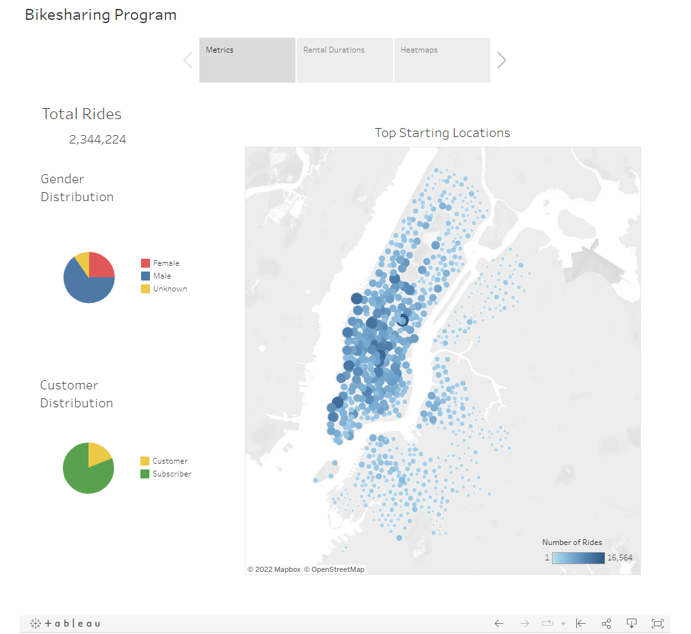
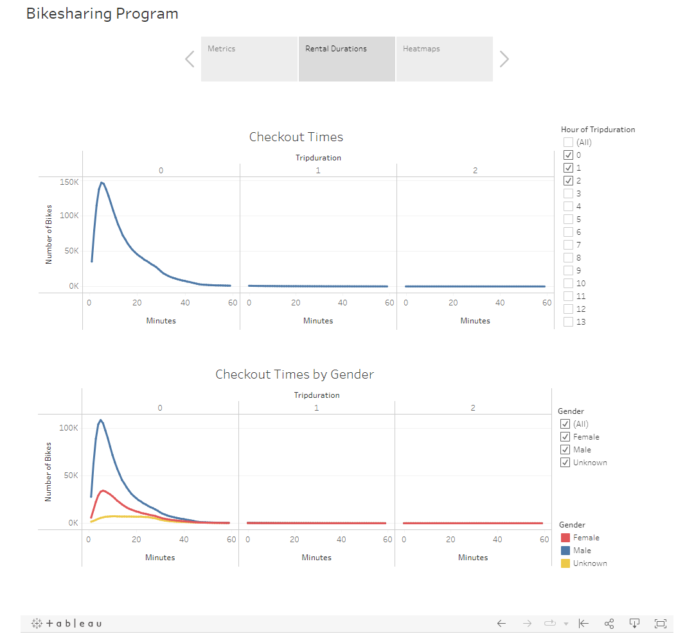
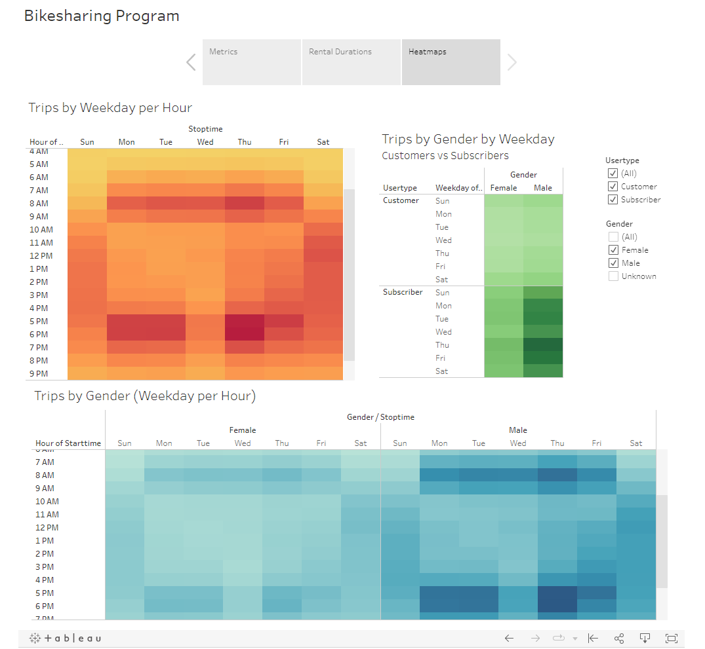

# Bikesharing Program

## Overview:
To evaluate the viability of opening a bikesharing program in another city, we created various data visualizations in Tableau based on user demographics and usage trends.

## Findings:
### Key Metrics
#### In the first page of our Tableau Story, we have presented the following:
1. The total ride count for the month of August 2019.
2. Gender Distribution - just over 65% of our customer base are Males, while Females account for only ~25% of our customer base.
3. Customer Distribution - we see that approximately 81% of our customer base hold subscriptions to our service.
4. Top Starting Locations - this map shows that our customers generally begin their rides in the heart of the city (to navigate between destinations). However, we can also see that there are clusters of starting locations outside of the city (possibly commuters who bike into the city for work).

 
#### On the second page of our story, we specifically looked at the typical durations that our customers are renting our bikes.

5. Checkout Times - this graph shows all customer rentals, broken out between rentals lasting 0, 1 and 2 hours. We see that most customers rent our bikes for less than half an hour, with 5 minutes being the most common rental time.
6. Checkout Times by Gender - we broke out the Checkout Times graph by customer gender. Here, consistent with our expectations, we see that most bike rentals (accross genders) are under 30 minutes.

#### On the final page of our story, we wanted to analyze whether there were certain times in a day or certain days of the week, which were more popular for bike riding.
7. Trips by Weekday per Hour - When looking at our entire customer base, we see a few different trends.
    - On Weekdays, our heatmap shows that rental start times are mostly concentrated around 8AM in the mornings (before the typical work day), and 5-6PM in the evening (after the typical workday). This indicates that our bikes are predominantly utilized for work commutes during the work week.
    - On Weekends, we see that bike rentals begin a bit later in the morning, and are farily evenly distributed throughout sunshine hours. This likely indicates that our bikes are being utilized by tourists or for sightseeing on weekends.
8. Trips by Gender by Weekday (Customers vs Subscribers) - this heatmap reiterates many of the findings we describe above. We again see that the majority of our business goes to male subscribers.
9. Trips by Gender (Weekday per Hour) - this heatmap again reiterates many of the findings we describe above. The majority of our business appears to be male subscribers, and further, the peak rental times are at the typical commute hours during the workweek.

### Summary
In summary, we found that the biggest use-case for the New York bikesharing program, appears to be commuting to and from work, and that this service appears to be more popular among the male demographic. In order to bring this analysis to the next level, two additional visualizations we may want to look at include:
1. We might want to map out the bike stations and the number of bikes at each station at any given time. The markers on the map could be darker, the fewer bikes there are. Doing this would allow us to visualize whether there have been any 'missed opportunities' where a customer might have wanted to rent a bike from a particular station, but none were available.
2. We could modify our checkout times graphs by adding a filter on 'customer type' rather than 'gender'. This would allow us to assess whether there is a difference in behavior between regular customers vs subscription customers (i.e. do subscription customers tend to rent bikes for longer or shorter trips?)

## Links:

[View on GitHub Pages](https://justgitcoding.github.io/bikesharing/)

[Link to Tableau Public](https://public.tableau.com/views/Bikesharing_Viz/BikesharingProgram?:language=en-US&publish=yes&:display_count=n&:origin=viz_share_link)
## Tools
- Tableau Public
- Python (Pandas library using Jupyter Notebook)

